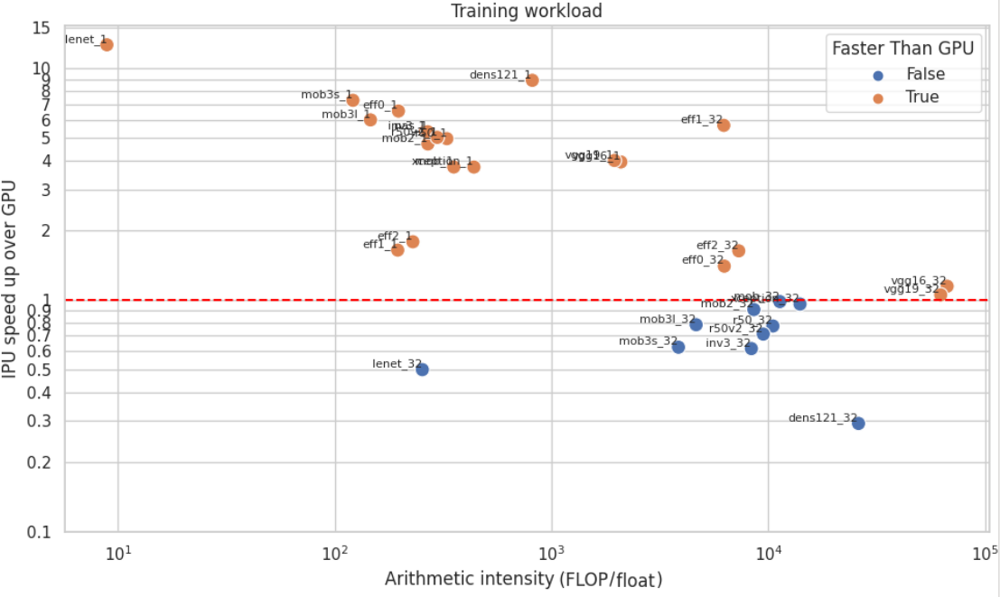
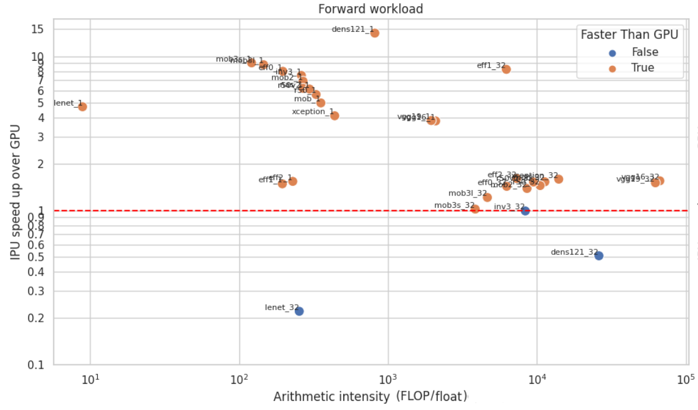

# IPU_GPU_running_context
RunningContext object allows to simplify the deployment of deep learning on multi-IPUs or multi-GPUs.

# Comparison between IPU M-2000 and GPU V100

I create a "main" file to iterate on 20 official neural networks with 1 and 32 batch size values. The identical code was executed on both IPU and GPU. The speedup ratio of the IPU over the GPU is depicted on the horizontal axis. Additionally, a secondary code was employed to extract Directed Acyclic Graph (DAG) characteristics, represented in terms of FLOP (Floating-Point Operations) and parameters, and these data points are also plotted on the horizontal axis. Each data point on the plot is labeled with the corresponding neural network architecture code name along with its associated batch size. For example, "eff1_32" corresponds to EfficientNetB1 with a batch size of 32. It is important to note that both axes are represented on a logarithmic scale.
In overall, training all those tasks one-by-one during 1 epoch takes 3h14 on GPU, 1h06 minutes on IPU, and would take 1h01 with ideal dispatch on IPU or GPU.

